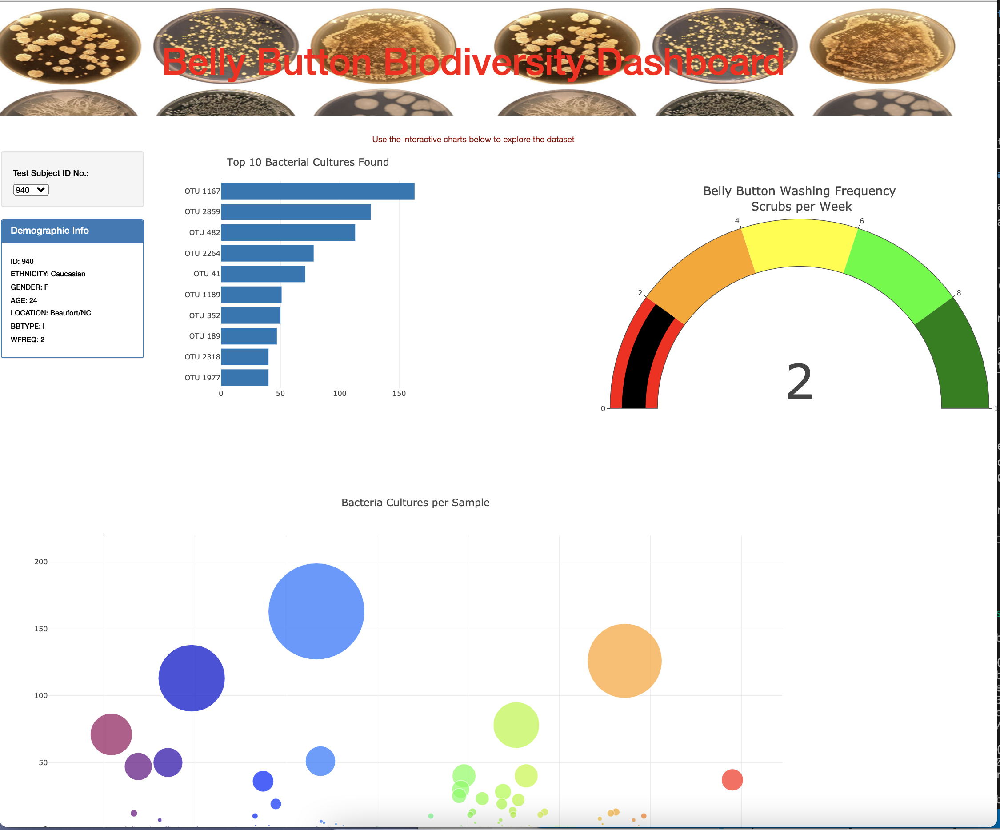

# Belly Button Biodiversity

## Overview of Project: 
The purpose of this project is to create a webpage dashboard to display belly button biodiversity research and information obtained from the test subjects.  The webpage dashboard has a dropdown option to select from a list of test subject ID's, then graphs of the data are displayed specifically to the selected sample.  For this project, Javascript, HTML, Plotly, bootstrap and CSS stylesheets were used to create the webpage and dynamic charts.

Belly Button Dashboard webpage:

## Results:

This is an interactive webpage that allows the user to take a closer look at the results of belly button bacteria research from a group of test subjects.  It lists the subjects' demographic information, as well as several interactive charts.  There is a bar chart displaying information on the top 10 bacterial cultures found, a gauge chart on frequency of wash during the test period and a bubble chart to visualize the bacterial cultures per sample.

## Summary: 

Creating dashboards allows data to be displayed in an engaging and interactive format.  This webpage was optimized for mobile responsiveness and can be accessed in multiple platforms without losing the interactive ability.  Images and change in font color can make the page more attractive and appealing.

## deployted to github: https://ehuimartinez.github.io/BellyIO/
